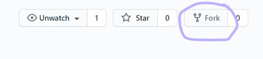
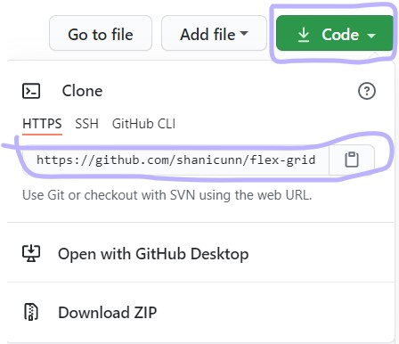

# **Flexbox and CSS Grid with Shani**!

## First we need to make sure we have the tools to begin.
- a Github account
- React installed on our computer
    - [Instructions to download the package manager](https://www.codecademy.com/articles/react-setup-i)

## Secondly we will:
- Fork this repository

- Click the **code** button and **clone** the forked repository

- Manuever into the folder you want to save your tutorial files in and type in your terminal:
> git clone [paste link here] 
- cd into your react app and type:
> npm start

## Now we've gotten to the good stuff!
- Open your react app in your favorite IDE
